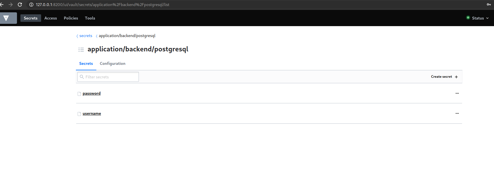

## Vault in Kubernetes
```bash
$ git clone https://github.com/hashicorp/vault-helm.git
$ cd vault-helm

# Checkout a tagged version
$ git checkout v0.3.3

# Run Helm
$ helm install --name vault ./

kubectl port-forward vault-0 8200:8200

kubectl exec -ti vault-0 -- vault operator init
Unseal Key 1: PslGadPjgsTFjjlwGj9vLg3sKJi7Q2W2BtIQj/Zr6Usa
Unseal Key 2: Mzd+rXOXuUk3h/4/6BJn+4XtKoHgda3bOxoI275PL27Z
Unseal Key 3: aH4xCrglCJqeiELRmnQ8LkO2+mPWyiZ3aBrcJ5+PcpSQ
Unseal Key 4: 6Ce9IlVm+aGGJ+02r3pqCIrsfFO/kCuvAnD9/M6ulNE/
Unseal Key 5: +p6yzETA6VYsqYW7K0x7yq/6fR9qJIz+osFSgpcbwnRk

Initial Root Token: s.ypGLrZ6MGNTB4qP5dUUVlQDP

vault secrets enable -path=<path-name> kv
vault secrets list

vault secrets enable -path=/application/backend/postgresql kv
vault write application/backend/postgresql/username value="jou"
vault write application/backend/postgresql/password value="3212112"

vim /tmp/policy.hcl

path "application/backend/postgresql/*" {
 capabilities = ["read"]
}

:wq!

vault write sys/policy/backend policy=@/tmp/policy.hcl
vault token create -policy=backend

# Output
Key                  Value
---                  -----
token                s.V2Jy6CKLTIiott6MuajC6WhG
token_accessor       sTQGYhVOrBwUkdFklfFP7NWk
token_duration       768h
token_renewable      true
token_policies       ["backend" "default"]
identity_policies    []
policies             ["backend" "default"]

# Exit current vault POD and run a new Ubuntu pod

vim  tiny-tools.yaml 

apiVersion: v1
kind: Pod
metadata:
  name: tiny-tools
  namespace: default
spec:
  containers:
  - name: tiny-tools
    image: giantswarm/tiny-tools
    command:
      - sleep
      - "3600"
    imagePullPolicy: IfNotPresent
  restartPolicy: Always
:wq!

kubectl apply -f tiny-tools.yaml
kubectl exec -it tiny-tools -- sh

curl -k -H 'X-Vault-Token: s.V2Jy6CKLTIiott6MuajC6WhG' http://vault:8200/v1/application/backend/postgresql/password

curl -k -H 'X-Vault-Token: s.V2Jy6CKLTIiott6MuajC6WhG' http://vault:8200/v1/application/backend/postgresql/username
```

